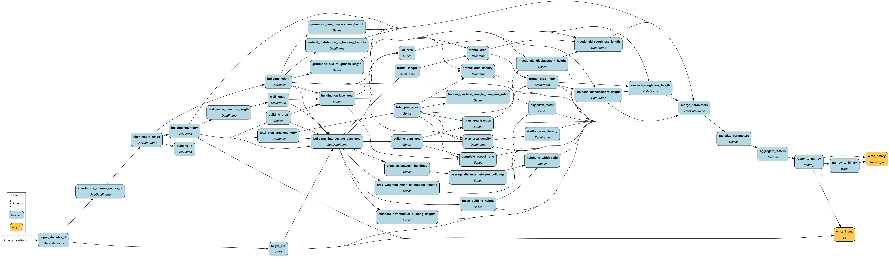

# Summary
The Neighborhood Adaptive Tissues for Urban Resilience Futures tool (NATURF) is a Python workflow that generates files readable by the Weather Research and Forecasting (WRF) model. NATURF uses *geopandas*[@kelsey_jordahl_2020_3946761} and *hamilton*[@DBLP:conf/vldb/KrawczykI22] to calculate 132 building parameters from shapefiles with building footprint and height information. These parameters can be collected and used in many formats, and the primary output is a binary file configured for input to WRF. This workflow is a flexible adaptation of the National/World Urban Database and Access Portal Tool (NUDAPT/WUDAPT)[@ching2009national][@mills2015introduction] that can be used with any study area at any spatial resolution. The climate modeling community and urban planners can identify the effects of building/neighborhood morphology on the microclimate using the urban parameters and WRF-readable files produced by NATURF. The source code for NATURF can be found on [Github](https://github.com/IMMM-SFA/naturf/tree/main), and more information on the urban parameters calculated can be found in the [documentation](https://immm-sfa.github.io/naturf/).

# Statement of Need
NATURF serves many audiences: (i) urban climate modelers wanting to understand building effects on the urban microclimate at a fine scale, (ii) urban planners creating new developments, (iii) sociologists aiming to understand weather-based inequalities and stresses. Allen-Dumas et al.[@allen2020impacts] used NATURF to  demonstrate that simulated new developments in the Chicago Loop neighborhood affect temperature and energy use both in the new developments and the preexisting neighborhoods. Their findings show that building effects on the microclimate can be modeled at 90m resolution, and they quantify how different configurations of urban developments affect not only the developments themselves but also neighborhoods that already exist. Urban planners will be able to use NATURF in the same way as urban areas continue to grow. Likewise, NATURF will give climate modelers the tools to understand how urbanization will contribute to microclimate and broader global climate change, and sociologists could see how urban developments affect weather-related stresses.

In relation to existing software, NATURF utilizes the same urban parameters and WRF pathways as NUDAPT and WUDAPT, but it does so at a higher spatial resolution for more detailed predictions. WUDAPT in particular seeks to gather consistent data on a worldwide scale[@ching2018wudapt] while NATURF works at a city- or neighborhood-scale. Put simply, NATURF allows the user to conduct studies at a high resolution at any location where building footprint and height data exist.

Similar to NATURF, the open-source toolbox GeoClimate[@bocher2021geoclimate] aims to quantify the effect of urban features for climate models. Both tools provide outputs similar to the three levels of data associated with WUDAPT: level 0 data (local climate zones), level 1 data (sampling data with finer resolution), and level 2 data (precise urban parameter data)[@ching2018wudapt]. GeoClimate produces level 0 and level 1 data, while NATURF provides level 2 data. Where NATURF uses building height and footprint data to calculate urban parameters, GeoClimate uses OpenStreetMap data. GeoClimate also calculate different parameters from NATURF and considers the influences of vegetation and roads on the microclimate. NATURF and GeoClimate measure the effect of urban features on microclimate, but they use different source data and output different data products to do so.

# Design and Functionality
NATURF uses *hamilton* for organization and visualization of its workflow. Function names become inputs to other functions, allowing for a delineation of dependencies for every function. This code format allows for easier troubleshooting and visualization of the workflow. The calculation of parameters itself is done through *geopandas*. The input shapefile is loaded in as a GeoDataFrame that can handle calculation of parameters for each building in one process as opposed to using long "for" or "while" loops. Likewise, the geospatial features of *geopandas* are conducive to calculating the urban parameters for NATURF which are based on the geometry of each building and its neighbors. Figure 1 shows one of these parameters, mean building height at 100 meter resolution over Los Angeles County.

# Acknowledgements
This research was supported by the U.S. Department of Energy, Office of Science, as part of research in MultiSector Dynamics, Earth and Environmental System Modeling Program.

Sponsored by the DOE Office of Science as a part of the research in Multi-Sector Dynamics within the Earth and Environmental System Modeling Program as part of
the Integrated Multiscale Multisector Modeling (IM3) Scientific Focus Area.
# References
