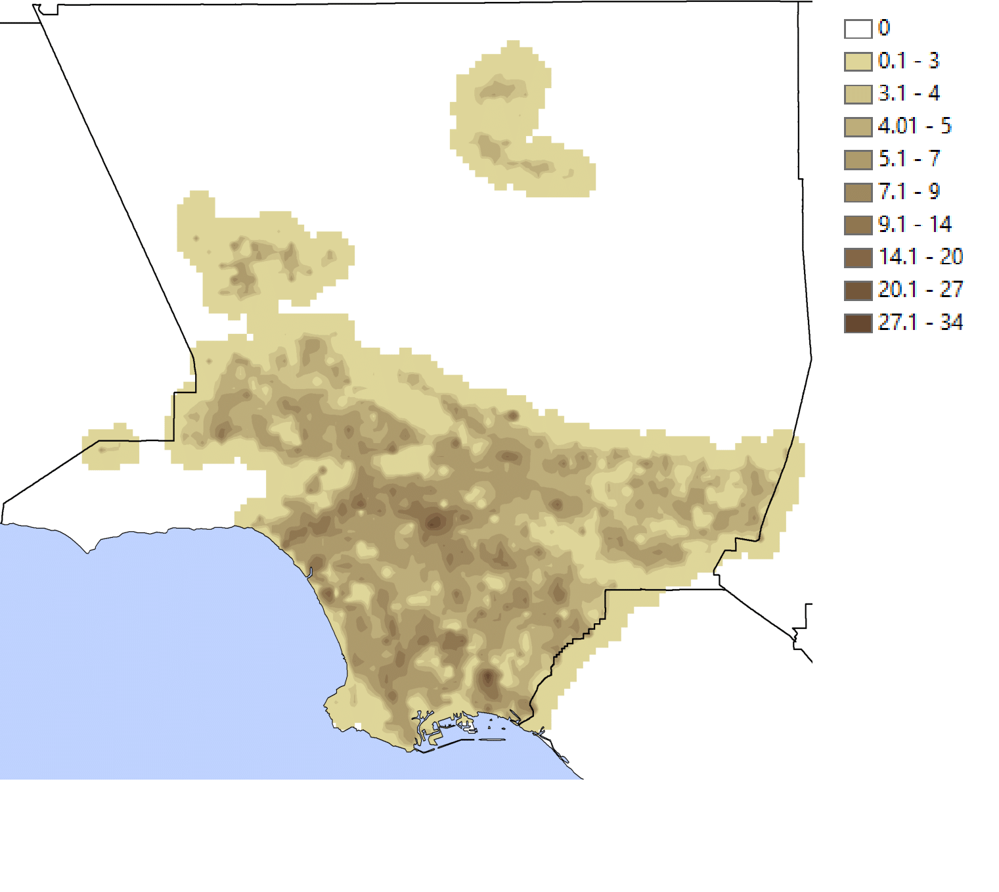

# Summary
The Neighborhood Adaptive Tissues for Urban Resilience Futures tool (NATURF) is a Python workflow that generates files readable by the Weather Research and Forecasting (WRF) model. NATURF uses *geopandas* [@kelsey_jordahl_2020_3946761] and *hamilton* [@DBLP:conf/vldb/KrawczykI22] to calculate 132 building parameters from shapefiles with building footprint and height information. These parameters can be collected and used in many formats, and the primary output is a binary file configured for input to WRF. This workflow is a flexible adaptation of the National/World Urban Database and Access Portal Tool (NUDAPT/WUDAPT) [@ching2009national; @mills2015introduction] that can be used with any study area at any spatial resolution. The climate modeling community and urban planners can identify the effects of building/neighborhood morphology on the microclimate using the urban parameters and WRF-readable files produced by NATURF. More information on the urban parameters calculated can be found in the [documentation](https://immm-sfa.github.io/naturf/).

# Statement of Need
Fine-resolution, three-dimensional representations of urban surfaces are necessary to support weather modeling at informative scales for understanding urban microclimate effects on public health and energy use [@best2006progress]. NUDAPT/WUDAPT were both created to address this need, but data is only currently available for select regions [@ching2009national] and using inputs such as satellite data [@ching2018wudapt] that could introduce uncertainties in the parameters produced [@wong2019evaluation]. NATURF uses building-level data to represent urban surfaces at sub-kilometer resolutions, allowing the user to conduct studies at a high resolution at any location where building footprint and height data exist. A preliminary version of NATURF was used to calculate urban parameters and demonstrate that simulated new developments in the Chicago Loop neighborhood in Chicago, Illinois, USA affect temperature and energy use both in the new developments and the preexisting neighborhoods [@allen2020impacts]. Their findings show that building effects on the microclimate can be modeled at 90m resolution, and they quantify how different configurations of urban developments affect not only the developments themselves but also neighborhoods that already exist. In this way, urban planners will be able to use NATURF to project how urban developments will affect meteorology within and outside of the new growth.

Similar to NATURF, the open-source toolbox GeoClimate [@bocher2021geoclimate] aims to quantify the effect of urban features for climate models. Both tools provide outputs for WRF to be used with the NUDAPT/WUDAPT framework, but at different resolutions. GeoClimate is intended for the production of local climate zones, data classified as level 0 by WUDAPT used to approximate urban parameters within the zone [@ching2018wudapt]. NATURF produces level 2 data, precise urban parameter data at finer resolutions. The input data used by each tool influences the resolution of outputs; GeoClimate primarily uses OpenStreetMap data where building heights must be estimated while NATURF uses shapefiles with building height and footprint data included. For both tools, study areas at the neighborhood-scale have comparable memory usage and computational time. For larger areas, particularly at the city-scale, NATURF is more suited for use on high-performance computers (HPC) due to the number and complexity of interactions being calculated. Despite this, installation and execution of NATURF requires only a few minutes and edits to code, and the use of *hamilton* allows for the tracking of code execution progress. Additionally, NATURF can internally produce outputs ready for WRF whereas GeoClimate requires the installation and use of additional packages. While NATURF and GeoClimate both produce urban parameter data for urban microclimate modeling, NATURF does so at a higher resolution with flexibility to analyze complex interactions between buildings at multiple scales.

# Design and Functionality
NATURF uses *hamilton* for organization and visualization of its workflow. Function names become inputs to other functions, allowing for a delineation of dependencies for every function. This code format allows for easier troubleshooting and visualization of the workflow (See \autoref{fig:dag}). Additionally, *hamilton* allows for the calculation of a specified subset of variables if the entire workflow is not desired. The calculation of parameters itself is done through *geopandas*. The input shapefile is loaded in as a GeoDataFrame that can handle calculation of parameters for each building in one process as opposed to using long "for" or "while" loops. Likewise, the geospatial features of *geopandas* are conducive to calculating the urban parameters for NATURF which are based on the geometry of each building and its neighbors. \autoref{fig:bldg_ht} shows one of these parameters, mean building height at 100 meter resolution over Los Angeles County, California, USA using open-source building data from Model America [@modelamerica]. The calculated urban parameters can be found [here](https://doi.org/10.57931/2349436) [@urbparams].

The primary functionality of NATURF is the calculation and preparation of building parameters to be input to WRF for enhanced understanding of the effect of building morphology on the urban microclimate. The final two functions in the NATURF workflow create a binary file and index file that can be linked into the "URB_PARAM" section of WRF's GEOGRID.TBL. However, the urban parameters calculated can be retrieved and used for any other user purposes. Users can define the desired parameters for calculation and then export them to a CSV for use in other software. This flexibility allows NATURF to serve audiences inside and outside of the climate modeling community.

# Acknowledgements
This research was supported by the U.S. Department of Energy, Office of Science, as part of research in MultiSector Dynamics, Earth and Environmental System Modeling Program.

Sponsored by the DOE Office of Science as a part of the research in Multi-Sector Dynamics within the Earth and Environmental System Modeling Program as part of
the Integrated Multiscale Multisector Modeling (IM3) Scientific Focus Area.

# References
